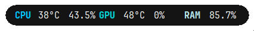

##currently being worked on. My apolocheeze

# TempMon 

A WIP lightweight temperature and ram usage monitor inspired by [@devyn.johnston](https://www.youtube.com/@devyn.johnston) and his MSI after burner [tutorial](https://www.youtube.com/watch?v=rRF6lW45c4c).

## Features

- always on top. (needs to be fixed)
- minimise to tray.
- run on startup.
- change UI font.

## TODO

- Change UI scale
- Change UI theme
- Add more stats

On first run, it may take a second to initialize. Otherwise every other run after should be fine.
The application was made depending on the Jetbrains Mono [font](https://www.jetbrains.com/lp/mono/) and LibreHardwareMonitor.

## Contributing

Contributions are welcome! Please feel free to submit a Pull Request.

## License

This project is licensed under the WTFPL License

## Disclaimer

This is a personal project intended for learning purposes. Please review the code and use at your own discretion.

